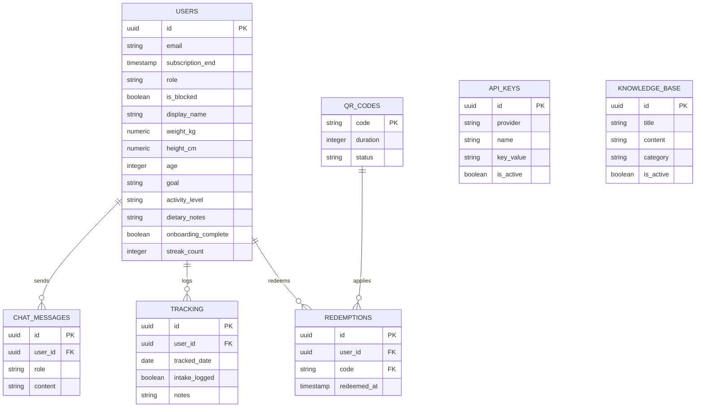

# 🍵 NutriSoy by Altaf

<p align="center">
  
  
  
  
  
</p>

---

### 🌌 Overview

**NutriSoy by Altaf** is a subscription-based, AI-driven nutrition coaching and habit-tracking platform. It uniquely bridges the gap between physical health products and digital lifestyle tools by allowing customers to scan QR codes on their NutriSoy packages (Susu Kedelai & Bubuk Kedelai) to redeem and unlock personalized, professional AI coaching access.

---

### 🌟 Core Capabilities

*   🤖 **Dynamic Multi-LLM AI Coach**: Integrated with OpenAI, Anthropic, DeepSeek, Gemini, and OpenRouter. It remembers your goals and dietary notes, provides personalized soy protein dosing, and operates under strict safety thresholds (1.2-2.0 g/kg protein limits).
*   🎟️ **QR Code Subscriptions**: Instantly redeem subscription days by scanning QR codes on physical packaging, backed by automatic barcode/QR scanning technologies.
*   📈 **Daily Habit Tracking & Streaks**: Record protein intake and view calendar streaks to maintain nutritional consistency and discipline.
*   ⚙️ **Powerful Admin Control Panel**:
    *   **User Management**: Role assignment and blocking control.
    *   **Bulk QR Generator**: Instantly generate and export activation codes.
    *   **AI Knowledge Base Manager**: Dynamically add and update references for the AI Coach.
    *   **API Key Settings**: Live key rotation and provider configurations.
    *   **Export Tools**: Zip-archived PDF progress reports generator.

---

### 🛠️ Architecture & Tech Stack

| Layer | Technology | Purpose |
| :--- | :--- | :--- |
| **Frontend** | **Next.js 16 (App Router)** | Framework with full React 19 SSR capabilities |
| **Styling** | **Tailwind CSS v4** | Dark-mode, glassmorphic layout, and transitions |
| **Database** | **Supabase Postgres** | Persistent relational storage, triggers, and Row Level Security (RLS) |
| **Authentication** | **Supabase Auth / SSR** | User state management, onboarding checks, and role guards |
| **AI Layer** | **Vercel AI SDK (`ai`)** | Streamed LLM interaction, structured prompts, and active tool calling |
| **Libraries** | **`html5-qrcode` & `html2pdf.js`** | Integrated webcam scanning and progress report generation |

---

### 📂 Database Schema Overview

The database is built on Supabase, featuring 8 principal tables with strict RLS:



---

### ⚙️ Implementation & Setup

#### 1. Supabase Initialization
1. Spin up a new PostgreSQL database on [Supabase](https://supabase.com/).
2. Navigate to the **SQL Editor** in the Supabase Dashboard.
3. Execute the schema definitions:
   *   Run `database/schema.sql` to deploy tables, default constraints, and RLS rules.
   *   Run `database/01_admin_features.sql` to prepare the database for the administration backend.

#### 2. Environment Variables
Create a `.env.production` file in the root directory:
```env
NEXT_PUBLIC_SUPABASE_URL="https://your-project-ref.supabase.co"
NEXT_PUBLIC_SUPABASE_ANON_KEY="your-anon-public-key"
SUPABASE_SERVICE_ROLE_KEY="your-service-role-secret-key"
CRON_SECRET="your-secure-cron-secret-token"
```

> [!WARNING]
> Keep your `SUPABASE_SERVICE_ROLE_KEY` hidden. Keep the repository private if keeping keys in `.env.production`.

#### 3. Run the Development Server
Install dependencies and launch:
```bash
# Install package dependencies
npm install

# Start Next.js dev server
npm run dev
```

Open [http://localhost:3000](http://localhost:3000) to view the application.

---

### 🧪 LLM Orchestration & Custom Tools

The AI Coach features **Active Memory Writing** through a custom tool-calling implementation:
```typescript
tools: {
  updateMemory: tool({
    description: 'Perbarui diet plan atau memory (dietary notes) user jika mereka memintanya secara eksplisit.',
    parameters: z.object({
      newGoal: z.enum(['bulking', 'cutting', 'maintenance']).optional(),
      dietaryNotes: z.string().optional(),
      weight_kg: z.number().optional()
    }),
    execute: async (args) => {
      // Updates user table in Supabase dynamically mid-conversation
    }
  })
}
```
This lets the assistant adjust weights, dietary strategies, and caloric preferences instantly based on natural language chats.

---

### 🤝 Support
Created and maintained by the NutriSoy development team. For custom enterprise integrations, contact Altaf directly.
